# {{ page.title }}

Diffusion Models are generative models which have been gaining significant popularity in the past several years, and for good reason. A handful of seminal papers released in the 2020s alone have shown the world what Diffusion models are capable of, such as beating GANs[6] on image synthesis. Most recently, practitioners will have seen Diffusion Models used in DALL-E 2, OpenAI's image generation model released last month.

<figure>
  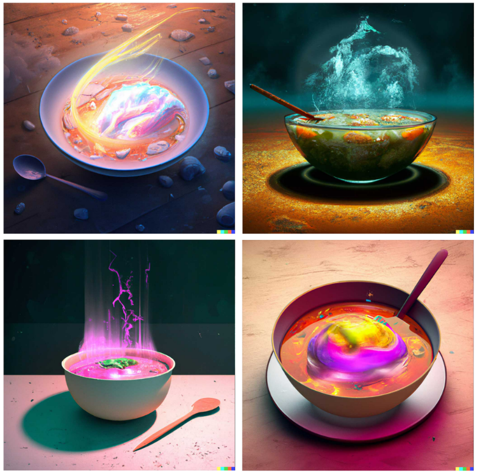
  <figcaption align = "center">Various images generated by DALL-E 2</figcaption>
</figure>

Given the recent wave of success by Diffusion Models, many Machine Learning practitioners are surely interested in their inner workings. In this article, we will examine the theoretical foundations for Diffusion Models, and then demonstrate how to generate images with a Diffusion Model in PyTorch. Let's dive in!

## Introduction

Diffusion Models are generative models, meaning that they are used to generate data similar to the data on which they are trained. Fundamentally, Diffusion Models work by destroying training data through the successive addition of Gaussian noise, and then learning to recover the data by reversing this noising process. After training, we can use the Diffusion Model to generate data by simply passing randomly sampled noise through the learned denoising process.

<figure>
  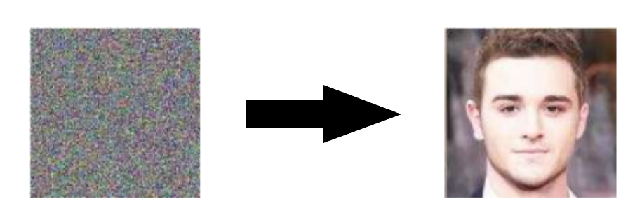
  <figcaption align = "center">Diffusion Models can be used to generate images from noise</figcaption>
</figure>

More specifically, a Diffusion Model is a latent variable model which maps to the latent space using a fixed Markov chain. This chain gradually adds noise to the data in order to obtain the approximate posterior \\(q(x_1:x_T\|x_0)\\), where \\(x_1,\cdots,x_T\\) are the latent variables with the same dimensionality as \\(x_0\\). In the figure below, we see such a Markov chain manifested for image data.

### Benefits of Diffusion Models

As mentioned above, research into Diffusion Models has exploded in recent years. Inspired by non-equilibrium thermodynamics[1], Diffusion Models currently produce State-of-the-Art image quality, examples of which can be seen below:

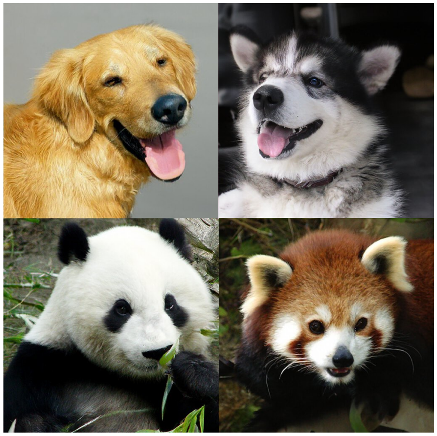

Beyond cutting-edge image quality, Diffusion Models come with a host of other benefits, including not requiring adversarial training. The difficulties of adversarial training are well-documented; and, in cases where non-adversarial alternatives exist with comparable performance and training efficiency, it is usually best to utilize them. On the topic of training efficiency, Diffusion Models also have the added benefits of scalability and parallelizability.

While Diffusion Models almost seem to be producing results out of thin air, there are a lot of careful and interesting mathematical choices and details that provide the foundation for these results, and best practices are still evolving in the literature. Let's take a look at the mathematical theory underpinning Diffusion Models in more detail now.

## Diffusion Models - A Deep Dive

As mentioned above, a Diffusion Model consists of a forward process (or diffusion process), in which a datum (generally an image) is progressively noised, and a reverse process (or reverse diffusion process), in which noise is transformed back into a sample from the target distribution.

The sampling chain transitions in the forward process can be set to conditional Gaussians when the noise level is sufficiently low. Combining this fact with the Markov assumption leads to a simple parameterization of the forward process:

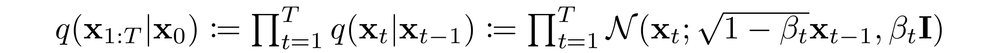

Where \\(\beta_1,\cdots,\beta_T\\) is a variance schedule (either learned or fixed) which, if well-behaved, ensures that \\(x_T\\) is nearly an isotropic Gaussian for sufficiently large \\(T\\).

<figure>
  
  <figcaption align = "center">
    Given the Markov assumption, the joint distribution of the latent variables is the product of the Gaussian conditional chain transitions
  </figcaption>
</figure>

As mentioned previously, the "magic" of diffusion models comes in the reverse process. During training, the model learns to reverse this diffusion process in order to generate new data. Starting with the pure Gaussian noise \\(p(x_T)=\mathcal{N}(x_T, 0, I)\\), the model learns the joint distribution \\(p_\theta(x_0:x_T)\\) as 

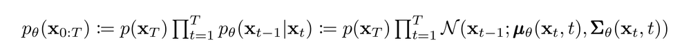

where the time-dependent parameters of the Gaussian transitions are learned. Note in particular that the Markov formulation asserts that a given reverse diffusion transition distribution depends only on the previous timestep (or following timestep, depending on how you look at it):

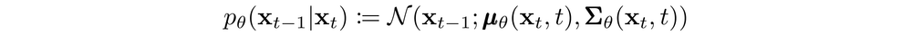

### training

A Diffusion Model is trained by finding the reverse Markov transitions that maximize the likelihood of the training data. In practice, training equivalently consists of minimizing the variational upper bound on the negative log likelihood.

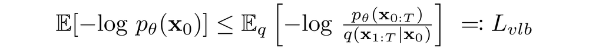

We seek to rewrite the \\(L_{vlb}\\) in terms of Kullback-Leibler (KL) Divergences. The KL Divergence is an asymmetric statistical distance measure of how much one probability distribution P differs from a reference distribution Q. We are interested in formulating  \\(L_{vlb}\\) in terms of KL divergences because the transition distributions in our Markov chain are Gaussians, and the KL divergence between Gaussians has a closed form.

<b>What is the KL Divergence? </b>

The mathematical form of the KL divergence for continuous distributions is

<figure>
  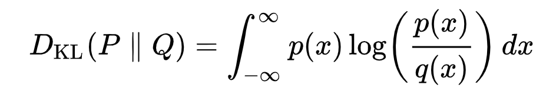
  <figcaption align = "center">
    The double bars indicate that the function is not symmetric with respect to its arguments.
  </figcaption>
</figure>

Below you can see the KL divergence of a varying distribution P (blue) from a reference distribution Q (red). The green curve indicates the function within the integral in the definition for the KL divergence above, and the total area under the curve represents the value of the KL divergence of P from Q at any given moment, a value which is also displayed numerically. 

<video width="640" controls>
  <source src="img/KL_Divergence.mp4" type="video/mp4">
</video>

Casting \\(L_{vlb}\\) in Terms of KL Divergences

As mentioned previously, it is possible to rewrite \\(L_{vlb}\\) almost completely in terms of KL divergences:

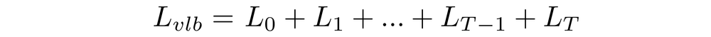

where

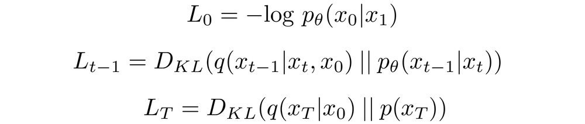

Conditioning the forward process posterior on \\(x_0\\) in \\(L_{t-1}\\)  results in a tractable form that leads to all KL divergences being comparisons between Gaussians. This means that the divergences can be exactly calculated with closed-form expressions rather than with Monte Carlo estimates.

### Model Choices

With the mathematical foundation for our objective function established, we now need to make several choices regarding how our Diffusion Model will be implemented. For the forward process, the only choice required is defining the variance schedule, the values of which are generally increasing during the forward process.

For the reverse process, we much choose the Gaussian distribution parameterization / model architecture(s). Note the high degree of flexibility that Diffusion Models afford - the only requirement on our architecture is that its input and output have the same dimensionality.

We will explore the details of these choices in more detail below.

Forward Process and \\(L_T\\)

As noted above, regarding the forward process, we must define the variance schedule. In particular, we set them to be time-dependent constants, ignoring the fact that they can be learned. For example, a linear schedule from \\(\beta_1=10^{-4}\\) to \\(\beta_T=0.2\\)  might be used, or perhaps a geometric series.

Regardless of the particular values chosen, the fact that the variance schedule is fixed results in \\(L_T\\) becoming a constant with respect to our set of learnable parameters, allowing us to ignore it as far as training is concerned.

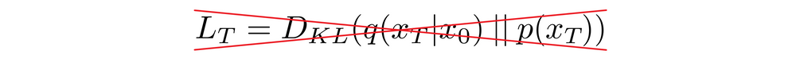

Reverse Process and \\(L_{1:T-1}\\)

Now we discuss the choices required in defining the reverse process. Recall from above we defined the reverse Markov transitions as a Gaussian:

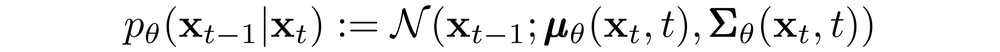

We must now define the functional forms of \\(\mu_\theta\\)
 or \\(\Sigma_\theta\\). While there are more complicated ways to parameterize \\(\Sigma_\theta\\), we simply set

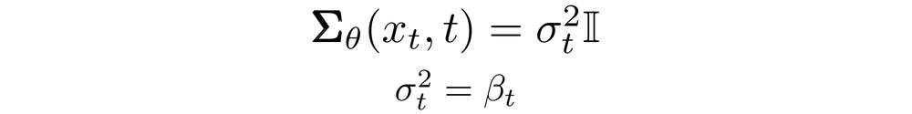

That is, we assume that the multivariate Gaussian is a product of independent gaussians with identical variance, a variance value which can change with time. We set these variances to be equivalent to our forward process variance schedule.

Given this new formulation of \\(\Sigma_\theta\\), we have

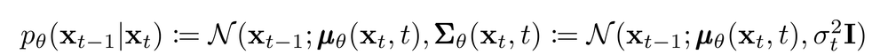

which allows us to transform

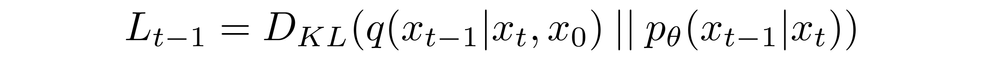

to

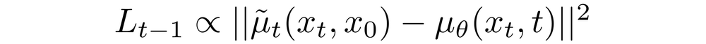

where the first term in the difference is a linear combination of \\(x_0\\) and \\(x_T\\)  that depends on the variance schedule \\(\beta_T\\) . The exact form of this function is not relevant for our purposes, but it can be found in [3].

The significance of the above proportion is that the most straightforward parameterization of \\(\mu_\theta\\) simply predicts the diffusion posterior mean. Importantly, the authors of [3] actually found that training \\(\mu_\theta\\) to predict the noise component at any given timestep yields better results. In particular, let

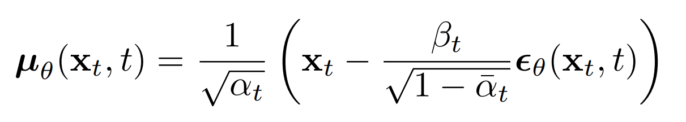

where

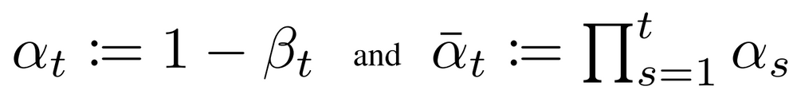

This leads to the following alternative loss function, which the authors of [3] found to lead to more stable training and better results:

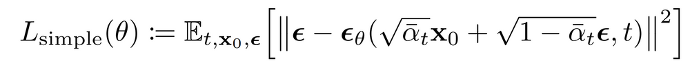

The authors of [3] also note connections of this formulation of Diffusion Models to score-matching generative models based on Langevin dynamics. Indeed, it appears that Diffusion Models and Score-Based models may be two sides of the same coin, akin to the independent and concurrent development of wave-based quantum mechanics and matrix-based quantum mechanics revealing two equivalent formulations of the same phenomena[2].

Network Architecture

While our simplified loss function seeks to train a model \\(\epsilon_\theta\\)
, we have still not yet defined the architecture of this model. Note that the only requirement for the model is that its input and output dimensionality are identical.

Given this restriction, it is perhaps unsurprising that image Diffusion Models are commonly implemented with U-Net-like architectures.

<figure>
  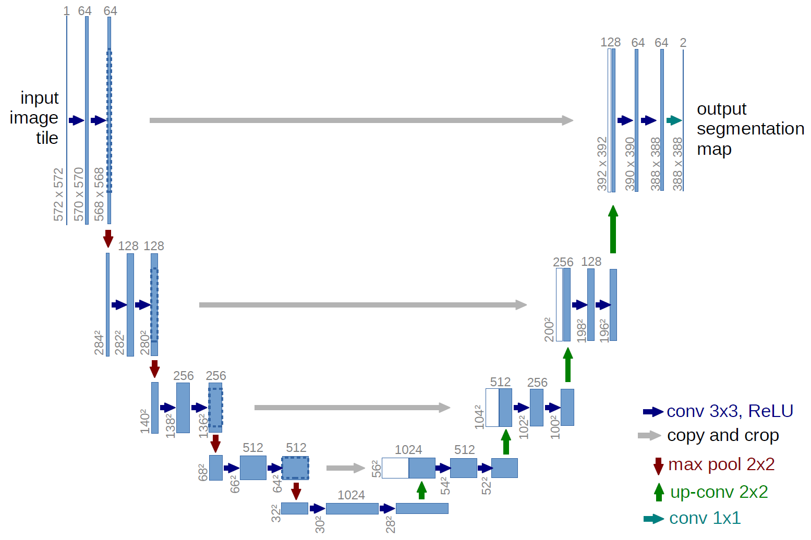
  <figcaption align = "center">
  Architecture of U-Net 
  </figcaption>
</figure>

Reverse Process Decoder and \\(L_0\\)

The path along the reverse process consists of many transformations under continuous conditional Gaussian distributions. At the end of the reverse process, recall that we are trying to produce an image, which is composed of integer pixel values. Therefore, we must devise a way to obtain discrete (log) likelihoods for each possible pixel value across all pixels.

The way that this is done is by setting the last transition in the reverse diffusion chain to an independent discrete decoder. To determine the likelihood of a given image \\(x_0\\) given \\(x_1\\), we first impose independence between the data dimensions:

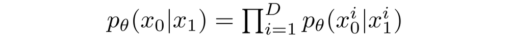

where D is the dimensionality of the data and the superscript i indicates the extraction of one coordinate. The goal now is to determine how likely each integer value is for a given pixel given the distribution across possible values for the corresponding pixel in the slightly noised image at time \\(t=1\\):

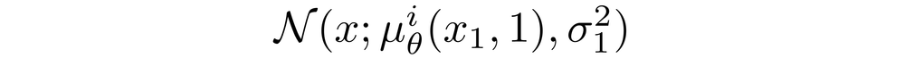

where the pixel distributions for  are derived from the below multivariate Gaussian whose diagonal covariance matrix allows us to split the distribution into a product of univariate Gaussians, one for each dimension of the data:

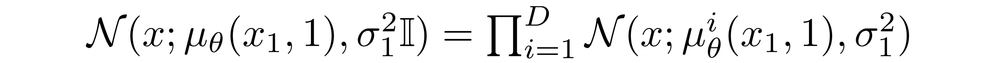

We assume that the images consist of integers in \\(0,1,\cdots,255\\) (as standard RGB images do) which have been scaled linearly to \\([-1, 1]\\). We then break down the real line into small "buckets", where, for a given scaled pixel value x, the bucket for that range is \\([x-1/255, x+1/255]\\). The probability of a pixel value x, given the univariate Gaussian distribution of the corresponding pixel in \\(x_1\\), is the area under that univariate Gaussian distribution within the bucket centered at \\(x\\).

Below you can see the area for each of these buckets with their probabilities for a mean-0 Gaussian which, in this context, corresponds to a distribution with an average pixel value of \\(255/2\\) (half brightness). The red curve represents the distribution of a specific pixel in the t=1 image, and the areas give the probability of the corresponding pixel value in the t=0 image.

<video width="640" controls>
  <source src="img/buckets_Trim.mp4" type="video/mp4">
</video>

Given a t=0 pixel value for each pixel, the value of \\(p_\theta(x_0\|x_1)\\) is simply their product. This process is succinctly encapsulated by the following equation:

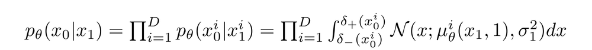

where

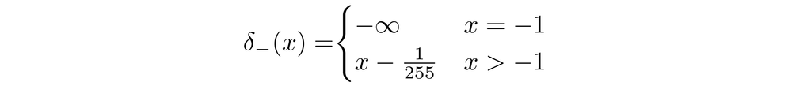

and

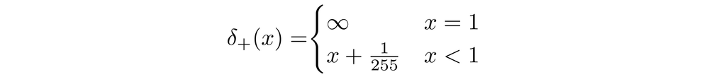

Given this equation for \\(p_\theta(x_0\|x_1)\\), we can calculate the final term of \\(L_{vlb}\\)  which is not formulated as a KL Divergence:

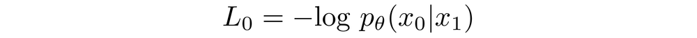

### Final Objective

As mentioned in the last section, the authors of [3] found that predicting the noise component of an image at a given timestep produced the best results. Ultimately, they use the following objective:

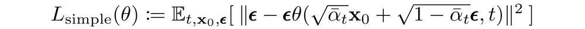

The training and sampling algorithms for our Diffusion Model therefore can be succinctly captured in the below figure:

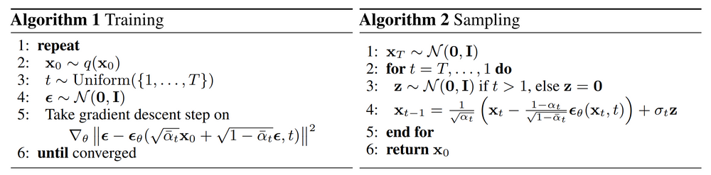

### Diffusion Model Theory Summary

In this section we took a detailed dive into the theory of Diffusion Models. It can be easy to get caught up in mathematical details, so we note the most important points within this section below in order to keep ourselves oriented from a birds-eye perspective:

1. Our Diffusion Model is parameterized as a Markov chain, meaning that our latent variables \\(x_1,\cdots, x_T\\) depend only on the previous (or following) timestep.
2. The transition distributions in the Markov chain are Gaussian, where the forward process requires a variance schedule, and the reverse process parameters are learned.
3. The diffusion process ensures that \\(x_T\\) is asymptotically distributed as an isotropic Gaussian for sufficiently large T.
4. In our case, the variance schedule was fixed, but it can be learned as well. For fixed schedules, following a geometric progression may afford better results than a linear progression. In either case, the variances are generally increasing with time in the series (i.e. \\(\beta_i<\beta_j\\) for \\(i < j\\) )
5. Diffusion Models are highly flexible and allow for any architecture whose input and output dimensionality are the same to be used. Many implementations use U-Net-like architectures.
6. The training objective is to maximize the likelihood of the training data. This is manifested as tuning the model parameters to minimize the variational upper bound of the negative log likelihood of the data.
7. Almost all terms in the objective function can be cast as KL Divergences as a result of our Markov assumption. These values become tenable to calculate given that we are using Gaussians, therefore omitting the need to perform Monte Carlo approximation.
8. Ultimately, using a simplified training objective to train a function which predicts the noise component of a given latent variable yields the best and most stable results.
9. A discrete decoder is used to obtain log likelihoods across pixel values as the last step in the reverse diffusion process.