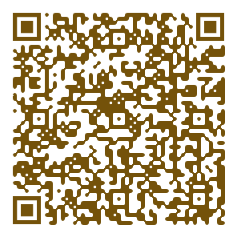

#### 下载地址

<a href="https://pan.baidu.com/s/1xMFPGSpHEQ_YiAAADSYViA" target="_blank">百度云盘</a>

提取码：3210 

使用中如遇任何问题可以反馈qq群：

<a target="_blank" href="https://qm.qq.com/cgi-bin/qm/qr?k=FIz8CmkavOB5GYwoR8xjBVJ95WJalQXJ&jump_from=webapi&authKey=+zj6q+B3kNrZWCMFoxi8W56mKAg5uvvxWe8JPe6YVRKXPIU3cKd37mkbQVH5x+Se">qq群：705791701</a>

<a href="https://www.bilibili.com/video/BV17D4y1k7Bh/?vd_source=afda6aefac862f3027a6a28fc43dc6ce" target="_blank">软件使用教程地址</a>

其他相关教程和工具详见：

[stable diffusion 中文网](http://www.stablediffusion.cc)

加AI创作微信群，可联系群主

(加v时请注明“加AI微信群”)

