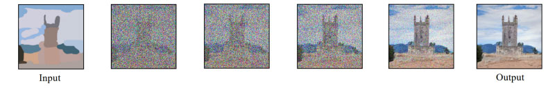
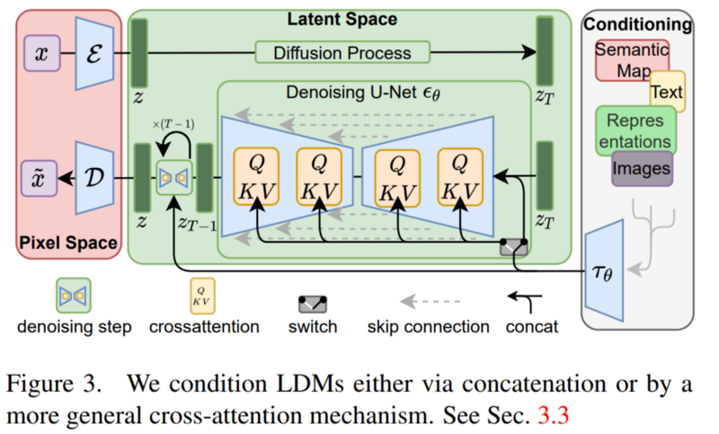
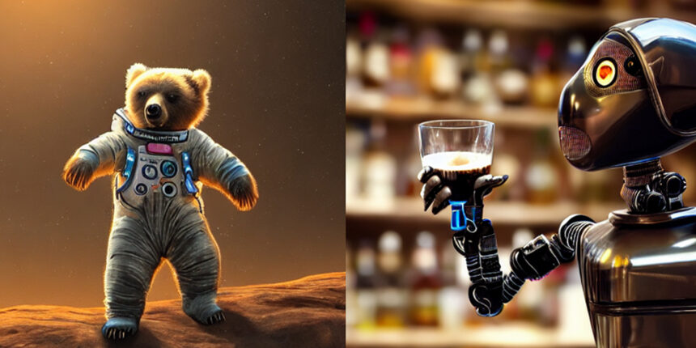

# {{ page.title }}

What do all recent super powerful image models like DALLE, Imagen, or Midjourney have in common? Other than their high computing costs, huge training time, and shared hype, they are all based on the same mechanism: diffusion.

Given the recent wave of success by Diffusion Models, many Machine Learning practitioners are surely interested in their inner workings. In this article, we will examine the theoretical foundations for Diffusion Models, and then demonstrate how to generate images with a Diffusion Model in PyTorch. Let's dive in!

There are a few downsides: they work sequentially on the whole image, meaning that both the training and inference times are expansive. This is why you need hundreds of GPUs to train such a model and why you wait a few minutes to get your results.

It’s no surprise that only the biggest companies like Google or OpenAI are releasing those models.

But what are they? I’ve covered diffusion models in a couple of articles, which I invite you to read for a better understanding. Quickly, they are iterative models that take random noise as inputs, which can be conditioned with a text or an image, so it is not completely random noise. It iteratively learns to remove this noise by learning what parameters the model should apply to this noise to end up with a final image. So the basic diffusion models will take random noise with the size of the image and learn to apply even further noise until we get back to a real image.

This is possible because the model will have access to the real images during training and will be able to learn the right parameters by applying such noise to the image iteratively until it reaches complete noise and is unrecognizable. Then, when we are satisfied with the noise we get from all images, meaning that they are similar and generate noise from a similar distribution, we are ready to use our model in reverse and feed it similar noise in the reverse order to expect an image similar to the ones used during training.

So the main problem here is that you are working directly with the pixels and large data inputs like images.

Let’s see how we can fix this computation issue while keeping the quality of the results the same, as shown here compared with DALLE.

How can these powerful diffusion models be computationally efficient? By transforming them into latent diffusion models. This means that Robin Rombach and his colleagues implemented this diffusion approach we just covered within a compressed image representation instead of the image itself and then worked to reconstruct the image. So they are not working with the pixel space, or regular images, anymore.

Working in such a compressed space does not only allow for more efficient and faster generations as the data size is much smaller but also allows for working with different modalities. Since they are encoding the inputs you can feed it any kind of input like images or texts and the model will learn to encode these inputs in the same sub-space that the diffusion model will use to generate an image. So yes, just like the CLIP model, one model will work with text or images to guide generations.

The overall model will look like this: you will have your initial image here X, and encode it into an information-dense space called the latent space, Z. This is very similar to a GAN where you will use an encoder model to take the image and extract the most relevant information about it in a sub-space, which you can see as a downsampling task. Reducing its size while keeping as much information as possible.

You are now in the latent space with your condensed input. You then do the same thing with your conditioning inputs, either text, images, or anything else, and merge them with your current image representation using attention, which I described in another video. This attention mechanism will learn the best way to combine the input and conditioning inputs in this latent space. Adding attention, a transformer feature, to diffusion models. These merged inputs are now your initial noise for the diffusion process.

Then, you have the same diffusion model I covered in my Imagen video but still in this sub-space.

Finally, you reconstruct the image using a decoder which you can see as the reverse step of your initial encoder. Taking this modified and de-noised input in the latent space to construct a final high-resolution image, basically upsampling your result.

And voilà! This is how you can use diffusion models for a wide variety of tasks like super-resolution, inpainting, and even text-to-image with the recent stable diffusion open-sourced model through the conditioning process while being much more efficient and allowing you to run them on your GPUs instead of requiring hundreds of them.

You heard that right. For all devs out there or even anyone wanting to play wanting to have their own text-to-image and image synthesis model running on their own GPUs (or just application), all the links and code are available with pre-trained models!

If you do use the model, please share your tests, ideas and results or any feedback you have with me! I’d love to chat about that.

Of course, this was just an overview of the latent diffusion model and I invite you to read their great paper linked below to learn more about the model and approach.

### References

- Rombach, R., Blattmann, A., Lorenz, D., Esser, P. and Ommer, B., 2022. High-resolution image synthesis with latent diffusion models. In Proceedings of the IEEE/CVF Conference on Computer Vision and Pattern Recognition (pp. 10684–10695), [https://arxiv.org/pdf/2112.10752.pdf](https://arxiv.org/pdf/2112.10752.pdf)
- Latent Diffusion Code: [https://github.com/CompVis/latent-diffusion](https://github.com/CompVis/latent-diffusion)
- Stable Diffusion Code (text-to-image based on LD): [https://github.com/CompVis/stable-diffusion](https://github.com/CompVis/stable-diffusion)
- Try it yourself: [https://huggingface.co/spaces/stabilityai/stable-diffusion](https://huggingface.co/spaces/stabilityai/stable-diffusion)

